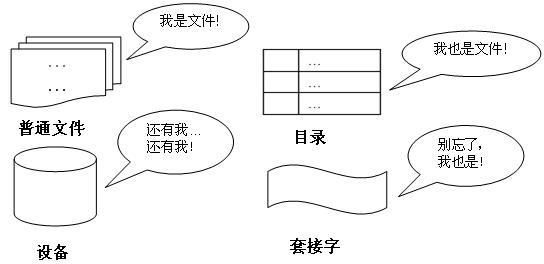

## 文件抽象

fs模块是文件操作的封装，它提供了文件的读取、写入、更名、删除、遍历目录、链接POSIX文件系统操作。与其他模块不同的是，fs模块中的所有操作都提供了异步和同步两个版本，例如读取文件内容函数的异步方法：readFile(),同步方法readFileSync()。


### 一切皆文件
“一切皆是文件”是 Unix/Linux 的基本哲学之一。不仅普通的文件，目录、字符设备、块设备、 套接字等在 Unix/Linux 中都是以文件被对待；它们虽然类型不同，但是对其提供的却是同一套操作接口。



文件是一种抽象机制，它对磁盘进行了抽象。

文件就是字节序列，每个I/O设备，包括磁盘、键盘、显示器、甚至网络，都可以抽象成文件，在Unix/Linux系统中，系统中所有的输入输出都是通过调用IO系统调用来完成。

文件是对IO的抽象，就像虚拟存储器是对程序存储的抽象，进程是对一个正在运行程序的抽象。这些都是操作系统重要的抽象。

抽象机制最重要的特性是对管理对象的命名，所以文件有文件名，且文件名要符合一定的规范。


### 文件主要操作
- open
- read
- write
- close
上面的操作比较简单，就不是细说，后面会写文章再介绍读文件、写文件、刷新数据这几个重要的操作。如果有兴趣，可以通过man 2 read 命令来查看帮助文档。


### 文件类型
可以通过ls -l查看文件类型，主要有下面几种常见的。
- 普通文件
  - 包括文本文件和二进制文件
- 目录 
  - 和普通文件相比，目录也存储在介质上，但是目录不存储常规文件，它只是用来组织、管理文件。
- proc文件
  - proc不存储，所以不占用任何空间，proc使得内核可以生成与系统状态和配置相关的信息，该信息可以由用户和系统内核从普通文件读取，无需专门的工具。
其它更多的文件类型，可以通过man ls 查看。


### 文件属性
文件属性包括文件权限信息、创建时间、最后修改时间、最后读取时间、文件大小、文件引用数等信息，这些文件属性也称为文件元数据。


### 文件系统之高级读写
#### 文件映射 mmap

`man 2 mmap` 查看：

```c++

#include <sys/mman.h>

void *mmap(void *addr, size_t len, int prot, int flags, int fd, off_t offset);

```
通过mmap系统调用，把一个文件映射到进程虚拟址址空间上。也就是说磁盘上的文件，现在在在系统看来是一个内存数组了，这样应用程序访问文件就不需要系统IO调用，而是直接读取内存。

#### 优点： 
* 1、从内存映像文件中读写，避免了read、write多余的拷贝。 
* 2、从内存映像文件中读写，避免了多余的系统调用和用户-内核模式的切换 
* 3、可以多个进程共享内存映像文件。

#### 缺点： 
* 1、内存映像需要时整数倍页大小，如果文件较小，会浪费内存。 
* 2、内存映像需要在放在进程地址空间，大的内存映像可能导致地址空间碎片，找不到足够大的空余连续区域供其它用。 


#### 离散IO 
readv和writev函数让我们在单个函数调用里从多个不连续的缓冲里读入或写出。这些操作被称为分散读（scatter read）和集合写（gather write）。

```c++

#include <sys/uio.h>

ssize_t readv(int filedes, const struct iovec *iov, int iovcnt);

ssize_t writev(int filedes, const struct iovec *iov, int iovcnt);

两者都返回读或写的字节数，错误返回-1。
```
这两个函数的第二个参数是指向iovec结构数组的一个指针：
```c++
struct iovec {
  void   *iov_base;      /* starting address of buffer */
  size_t iov_len;        /* size of buffer */
};
```
iov数组中的元素数由iovcnt说明。其最大值受限于IOV_MAX。


writev以顺序iov[0]，iov[1]至iov[iovcnt-1]从缓冲区中聚集输出数据。writev返回输出的字节总数，通常，它应等于所有缓冲区长度之和。

readv则将读入的数据按上述同样顺序散布到缓冲区中。readv总是先填满一个缓冲区，然后再填写下一个。readv返回读到的总字节数。如果遇到文件结尾，已无数据可读，则返回0。


### 总结

